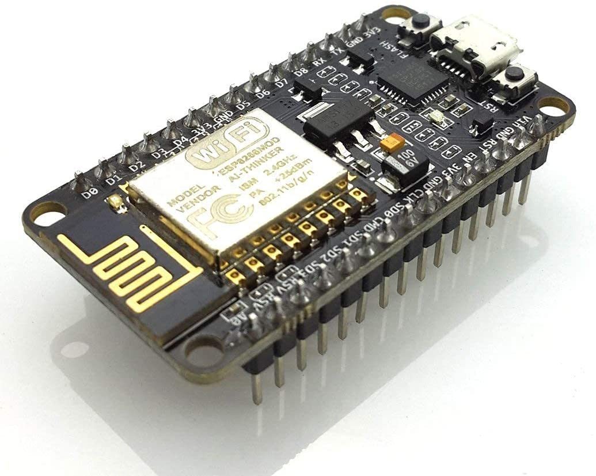
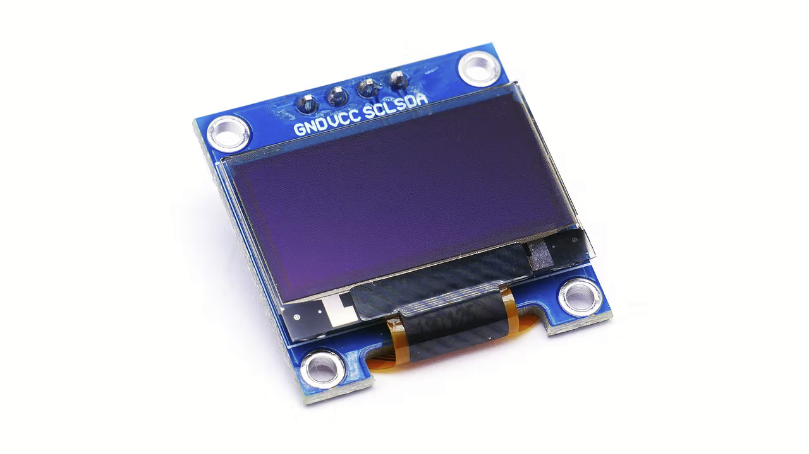

# HUD 

## Components

### [ESP8266](https://www.amazon.com/gp/product/B081CSJV2V/ref=ppx_yo_dt_b_asin_title_o01_s00?ie=UTF8&psc=1)

The ESP8266 is a $4 (up to $10) Wi-Fi module. It allows you to control inputs and outputs as you would do with an Arduino, but it comes with Wi-Fi.
So, it is great for home automation/internet of things applications.

So what can you do with this low cost module?
 * Create a web server
 * Send HTTP requests
 * Control outputs
 * Read inputs and interrupts

ESP8266 specifications:

 * 11 b/g/n protocol
 * Wi-Fi Direct (P2P), soft-AP
 * Integrated TCP/IP protocol stack
 * Built-in low-power 32-bit CPU
 * SDIO 2.0, SPI, UART

### [OLED Display](https://www.amazon.com/gp/product/B09JWN8K99/ref=ppx_yo_dt_b_asin_title_o01_s00?ie=UTF8&th=1) 

0.96 Inch OLED Module with 128x64 pixels

OLED specifications:
* IIC
* I2C
* Serial
* Self-Luminous Display Board

# HUD Folder Directories
The following table gives a brief summary of the contents of the top level directories.
Each directory may contain its own readme with more details.
| Directory                  | Details                                     |
| -------------------------- | --------------------------------------------|
| [drivers](drivers)         | Contains necessary drivers for a Windows machine to understand WiFi Module Controller |
| [web_server](web_server)   | Contains Arduino code to program WiFi and OLED devices. Contains 2 configurations, one for AP (or accespoint) and another one that connects to a local network. Code is almost identical between both configurations.   |

